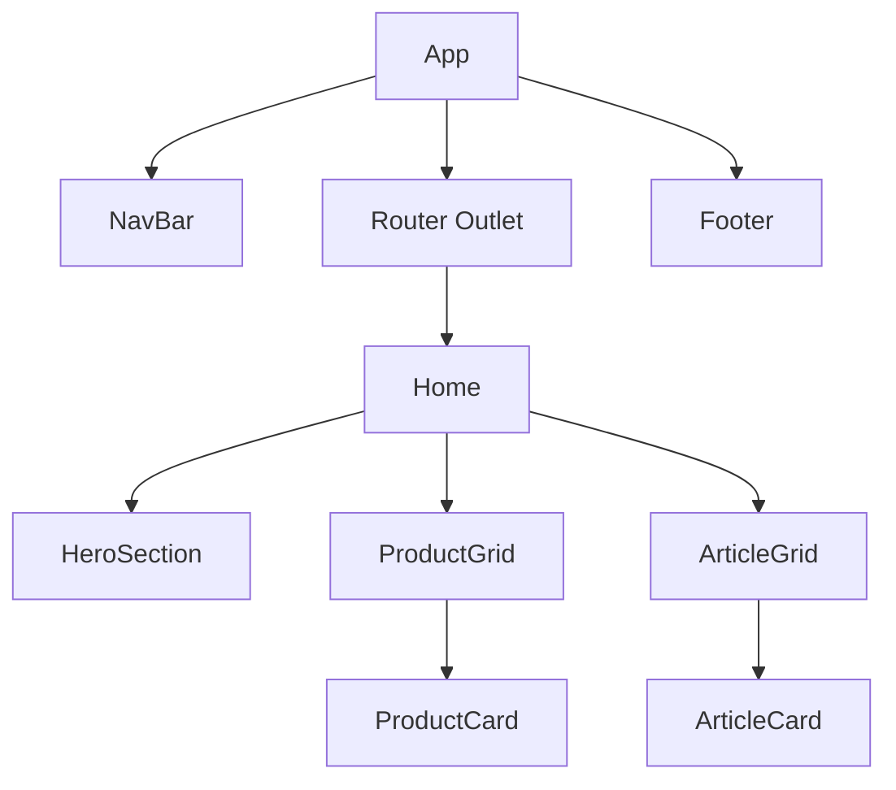

# ResponsiveShowcase

模擬產險官網首頁，展示 RWD 響應式網頁設計實作能力。

## 專案動機

日常工作聚焦於企業內部系統開發，對資料處理、表單串接、RESTful API 整合有紮實經驗。
為了持續學習、拓展前端技能廣度，特別透過此專案深化 RWD 響應式設計的實作能力。

## 技術棧

- **框架**: Angular 20 (zoneless)
- **UI 元件庫**: Angular Material
- **樣式**: SCSS
- **狀態管理**: Signals + RxJS

## RWD 技術亮點

依內容特性選用不同的響應式手法：

- **CDK `BreakpointObserver` + Signal**:用於結構性版面切換(NavBar 手機版漢堡選單 ↔ 桌面版橫向選單)
- **CSS Grid `auto-fill` + `minmax()`**:用於卡片群組自適應欄數(商品/文章列表)，無需手動維護多組斷點
- **傳統 Media Query**:用於漸進式視覺調整(Hero 區塊字級、Footer 欄位排列)

## 元件架構



## 執行方式

```bash
npm install
ng serve
```

開啟瀏覽器至 `http://localhost:4200`
